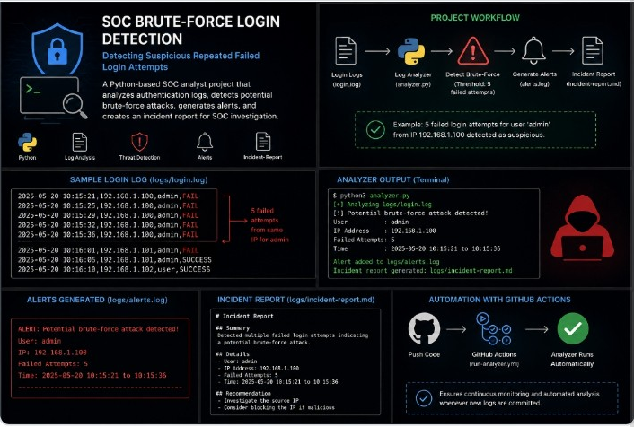
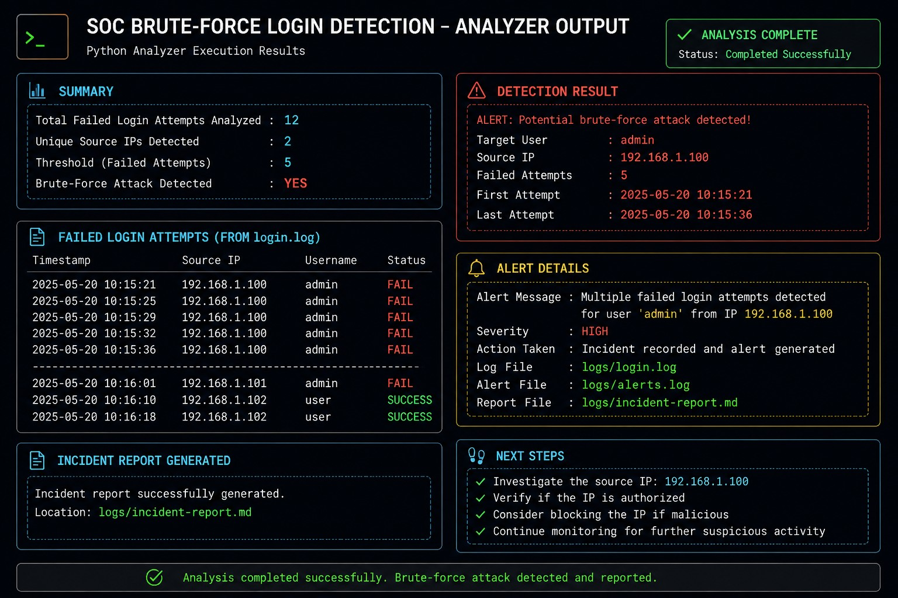
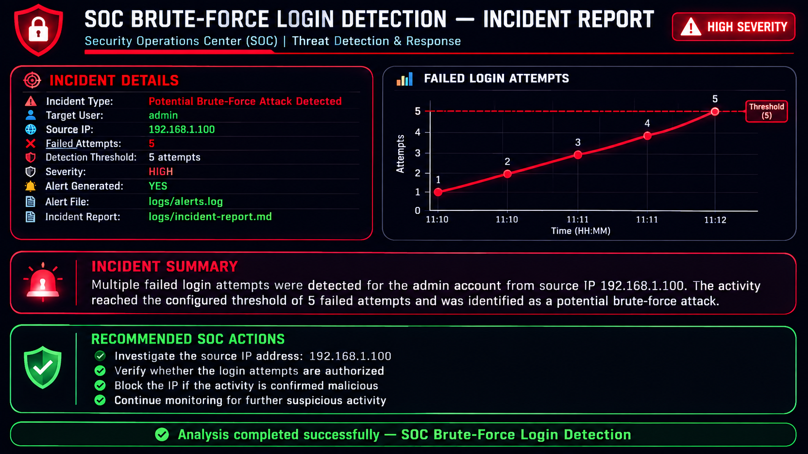

# SOC Brute-Force Login Detection
[](https://github.com/MUSAMMADJASMEEN/SOC-Brute-Force---login-Detection/actions/workflows/run-analyzer.yml)

## Recruiter Snapshot

**SOC Analyst Portfolio Project — Brute-Force Login Detection**

This project demonstrates practical SOC analyst skills by:

- Analyzing authentication logs for suspicious login activity
- Detecting repeated failed login attempts using a Python detection rule
- Generating HIGH-severity security alerts
- Investigating suspicious activity and documenting findings
- Producing an incident report for analyst review
- Automating detection with GitHub Actions
- Generating and verifying workflow artifacts

**Security scenario:** Five failed login attempts from the same source IP were followed by a successful login targeting the `admin` account, triggering a possible brute-force alert.

**Project status:** Completed and automated.

## Project Overview

This is a personal SOC Analyst project that detects possible brute-force login attacks by analyzing simulated authentication logs.

The project demonstrates log analysis, detection rules, alert generation, and incident reporting.

### Project Status

- Brute-force detection: Working
- Security alert generation: Working
- Incident reporting: Complete
- GitHub Actions automation: Working
- Workflow artifact generation: Verified

## 🚀 Quick Start

### 1. Clone the repository

```bash
git clone https://github.com/MUSAMMADJASMEEN/SOC-Brute-Force---login-Detection.git
cd SOC-Brute-Force---login-Detection
```
### Detection Logic

The analyzer follows this SOC detection workflow:

Authentication Logs
↓
Python Log Parsing
↓
Failed Login Count by Source IP
↓
Threshold Check (5+ failures)
↓
Check for Successful Login After Failures
↓
Generate HIGH-Severity Security Alert
↓
Save Alert & Incident Evidence
↓
GitHub Actions Automation

### Detection Rule

- Threshold: 5 failed login attempts
- Grouping: Source IP address
- Event types: `FAILED_LOGIN` and `SUCCESS_LOGIN`
- Escalation: HIGH severity
- Additional context: Successful login after repeated failures is flagged as possible account compromise
 ## Sample Detection Result

The analyzer detected five failed login attempts from the same source IP and identified a successful login shortly after the final failure.

**Detection Result:**
- Source IP: `192.168.1.50`
- Target Account: `admin`
- Failed Attempts: `5`
- Severity: `HIGH`
- Status: `OPEN`
- Assessment: Possible account compromise

The generated security alert is saved as an investigation artifact for SOC analyst review. 
## Evidence & Artifacts

The project generates and maintains investigation evidence during analysis:

- `logs/login.log` — simulated authentication events
- `logs/alerts.log` — generated security alert
- `logs/incident-report.md` — SOC incident report
- `analyzer.py` — Python detection and analysis logic
- `.github/workflows/run-analyzer.yml` — automated GitHub Actions workflow

The GitHub Actions workflow automatically runs the analyzer and verifies that the detection process completes successfully.
## Skills Demonstrated

- Python
- Log Analysis
- Brute-Force Detection
- Security Alerts
- Incident Reporting
- SOC Investigation

## Project Structure

- `logs/login.log` -  Authentication log data
- `analyzer.py` - Python detection script
- `logs/alerts.log` - Generated SOC security alerts
- `logs/incident-report.md` - Investigation report
- `README.md` - Project documentation

## Detection Rule

If an IP address generates **5 or more failed login attempts**, the system creates a **HIGH severity** alert.

## Example Alert

```text
Possible Brute-Force Attack
Source IP: 192.168.1.50
Failed Attempts: 5
```
## Detection Example

The analyzer detects repeated failed login attempts from the same source IP address.

### Detection Details

- Source IP: `192.168.1.50`
- Target Account: `admin`
- Failed Login Attempts: `5`
- Detection Threshold: `5`
- Alert Type: Possible Brute-Force Attack
- Severity: HIGH
- Status: OPEN

## Investigation Finding

Five failed login attempts from `192.168.1.50` targeting the `admin` account were followed by a successful login from the same source IP at `10:15:20`, approximately 7 seconds after the final failed attempt.

This pattern increases suspicion of possible account compromise, but the simulated logs alone do not confirm malicious activity.
### SOC Analyst Response

1. Investigate the source IP address.
2. Review surrounding authentication events.
3. Check whether a successful login occurred after the failed attempts.
4. Determine whether the target account may be compromised.
5. Follow the organization's incident-response procedures.

### Automation

GitHub Actions runs the analyzer and saves the generated security alerts as a workflow artifact.

Detection flow:

`Authentication Logs → Python Analyzer → Detection Rule → Security Alert → GitHub Actions Artifact`

## Sample Detection Result

- **Alert ID:** ALERT-001
- **Alert Type:** Possible Brute-Force Attack
- **Source IP:** `192.168.1.50`
- **Target Account:** `admin`
- **Failed Attempts:** 5
- **Severity:** HIGH
- **Status:** OPEN

### SOC Assessment

Five failed login attempts were detected from the same source IP, followed by a successful login approximately 7 seconds after the final failure. This pattern is suspicious and may indicate possible account compromise.

The simulated log data does not independently confirm malicious activity.

### Recommended SOC Actions

1. Investigate the source IP.
2. Review surrounding authentication logs.
3. Verify whether the successful login was authorized.
4. Review the `admin` account for suspicious activity.

> This project uses simulated authentication data for cybersecurity education and portfolio demonstration.

## 📩 Recruiter & Hiring Manager Contact

I am building my cybersecurity career through hands-on SOC Analyst projects focused on security monitoring, log analysis, threat detection, incident investigation, and security automation.

### 🛡️ Core Cybersecurity Skills

- **Python** — Security log analysis
- **Brute-Force Detection** — Identifying repeated failed login attempts
- **Threat Detection** — Detecting suspicious authentication activity
- **Security Alerts** — Alert generation and triage
- **Incident Response** — Investigation and incident reporting
- **GitHub Actions** — Security automation and workflow verification
- **SOC Operations** — Investigation, documentation, and evidence handling

### 🎯 Open to Opportunities

SOC Analyst | Junior SOC Analyst | Cybersecurity Analyst | Security Operations

I am looking for an opportunity where I can apply my cybersecurity skills, continue developing professionally, and contribute to a security operations team.

If my project work matches your team's requirements, I would be happy to connect and discuss relevant opportunities.

### 📬 Contact

**GitHub: https://github.com/MUSAMMADJASMEEN**

**LinkedIn: https://www.linkedin.com/in/musammad-jasmeen-22b458326**

**Email: musammadjasmeen@gmail.com**

«💼 Recruiters & Hiring Managers: Feel free to contact me directly regarding relevant cybersecurity opportunities.»

## Project Workflow



## Analyzer Output



## Incident Report


